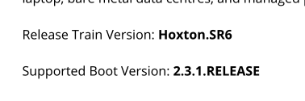
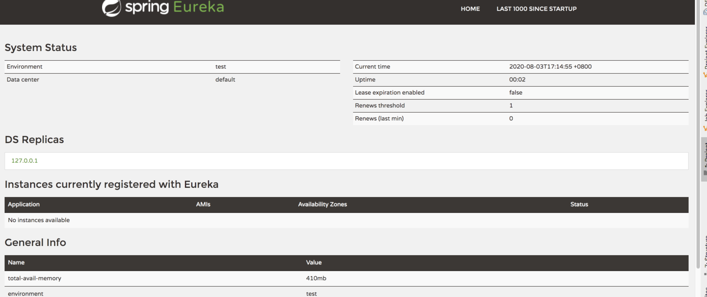
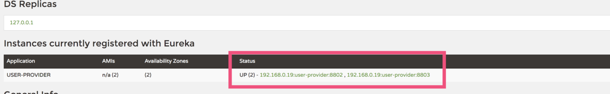
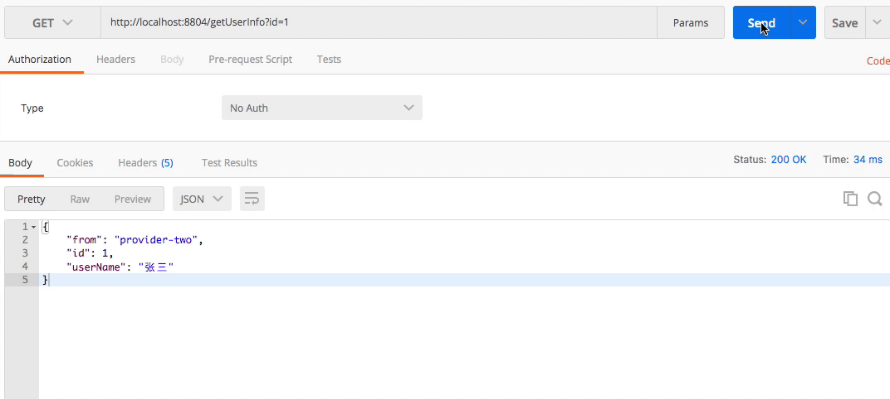
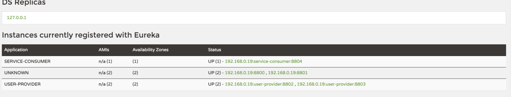

# 一文掌握Spring Cloud Erueka
> 通过此程序你可以学到 
>1. 搭建高可用的erueka server
>2. 服务提供者把服务发布到erueka server上 
>3. 消费者应用接入erueka Server进行服务调用
>4. 消费方通过ribbon达到负载均衡的调用provider服务

### 一、项目结构
##### eurekserver ，两个server，构建高可用
- eurekaServer     端口：8800
- eurekaServer2    端口：8801
##### eureka 服务提供者，两个Provider，服务
- eurekaProvider   端口：8802
- eurekaProvider2  端口：8803
##### eureka服务消费者，consumer，测试连接
- eurekaConsumer 端口：8804

### 二、项目搭建
- 版本选择:
Spring Cloud目前最新的Release版本是：Hoxton.SR6，通过官网查的,官方建议与之匹配的Spring Boot版本是：2.3.1.RELEASE

- springcloud版本：Hoxton.SR6
- springboot版本：2.3.1.RELEASE

### 三、搭建单机版eruekaServer
- 在idea中通过Spring Initializr来创建springCloud项目eruekaServer（傻瓜式操作，不描述）

- **pom.xml 引入spring-cloud-starter-netflix-eureka-server**
```
	 <parent>
    		<groupId>org.springframework.boot</groupId>
    		<artifactId>spring-boot-starter-parent</artifactId>
    		<version>2.3.1.RELEASE</version>
    		<relativePath/> <!-- lookup parent from repository -->
    	</parent>
    
    	<groupId>com.fqh</groupId>
    	<artifactId>server</artifactId>
    	<version>0.0.1-SNAPSHOT</version>
    	<name>eruekaServer</name>
    
    	<properties>
    		<java.version>1.8</java.version>
    		<spring-cloud.version>Hoxton.SR6</spring-cloud.version>
    	</properties>
    
    	<dependencies>
    		<dependency>
    			<groupId>org.springframework.cloud</groupId>
    			<artifactId>spring-cloud-starter</artifactId>
    		</dependency>

    		<dependency>
    			<groupId>org.springframework.cloud</groupId>
    			<artifactId>spring-cloud-starter-netflix-eureka-server</artifactId>
    		</dependency>
    	</dependencies>
```

- **EruekaServerApplication 加入@EnableEurekaServer注解**
```
@EnableEurekaServer
@SpringBootApplication
public class EruekaServerApplication {

	public static void main(String[] args) {
		SpringApplication.run(EruekaServerApplication.class, args);
	}
}
```
- **yml配置文件中 加入eureka相关配置**
```
server:
  port: 8800
eureka:
  instance:
    hostname: 127.0.0.1
    prefer-ip-address: true
    leaseExpirationDurationInSeconds: 15
  client:
    register-with-eureka: false
    fetch-registry: false
    service-url:
      defaultZone: http://${eureka.instance.hostname}:8800/eureka/
```
这里需要注意：单机版的erueka server的client配置里，需要把register-with-eureka与fetch-registry参数都设置成false
表示此此erueka启动后不向自己进行注册，也不从自己读取注册信息。
启动EruekaServerApplication，查看日志，发现eruekaServer已经启动
```
Setting the eureka configuration..
2020-08-03 17:12:11.598  INFO 30533 --- [     Thread-383] o.s.c.n.e.server.EurekaServerBootstrap   : Eureka data center value eureka.datacenter is not set, defaulting to default
2020-08-03 17:12:11.599  INFO 30533 --- [     Thread-383] o.s.c.n.e.server.EurekaServerBootstrap   : Eureka environment value eureka.environment is not set, defaulting to test
2020-08-03 17:12:11.623  INFO 30533 --- [     Thread-383] o.s.c.n.e.server.EurekaServerBootstrap   : isAws returned false
2020-08-03 17:12:11.623  INFO 30533 --- [     Thread-383] o.s.c.n.e.server.EurekaServerBootstrap   : Initialized server context
2020-08-03 17:12:11.624  INFO 30533 --- [     Thread-383] c.n.e.r.PeerAwareInstanceRegistryImpl    : Got 1 instances from neighboring DS node
2020-08-03 17:12:11.624  INFO 30533 --- [     Thread-383] c.n.e.r.PeerAwareInstanceRegistryImpl    : Renew threshold is: 1
2020-08-03 17:12:11.624  INFO 30533 --- [     Thread-383] c.n.e.r.PeerAwareInstanceRegistryImpl    : Changing status to UP
2020-08-03 17:12:11.635  INFO 30533 --- [     Thread-383] e.s.EurekaServerInitializerConfiguration : Started Eureka Server
```
打开浏览器输入localhost:8800,发现eureka已经启动，并且Instances currently registered with Eureka中注册的服务列表为空


### 四、服务提供者把服务发布到erueka server中
- 在idea中通过Spring Initializr来创建springCloud项目eruekaProvider，这里我们搭建2台provider实例（eruekaProvider与eruekaProvider2）

- **pom.xml 引入spring-cloud-starter-netflix-eureka-client**
```
	<parent>
		<groupId>org.springframework.boot</groupId>
		<artifactId>spring-boot-starter-parent</artifactId>
		<version>2.3.1.RELEASE</version>
		<relativePath/> <!-- lookup parent from repository -->
	</parent>
	<groupId>com.fqh</groupId>
	<artifactId>provider</artifactId>
	<version>0.0.1-SNAPSHOT</version>
	<name>eruekaProvider</name>

	<properties>
		<java.version>1.8</java.version>
		<spring-cloud.version>Hoxton.SR6</spring-cloud.version>
	</properties>

	<dependencies>
		<dependency>
			<groupId>org.springframework.cloud</groupId>
			<artifactId>spring-cloud-starter</artifactId>
		</dependency>

		<dependency>
			<groupId>org.springframework.boot</groupId>
			<artifactId>spring-boot-starter-web</artifactId>
		</dependency>

		<dependency>
			<groupId>org.springframework.cloud</groupId>
			<artifactId>spring-cloud-starter-netflix-eureka-client</artifactId>
		</dependency>
```

- **EruekaProviderApplication 加入@EnableDiscoveryClient注解,并且提供getUser方法对外提供Rest服务（注意这里返回信息的from显示provider-one）**
```
@RestController
@EnableDiscoveryClient
@SpringBootApplication
public class EruekaProviderApplication {

	public static void main(String[] args) {
		SpringApplication.run(EruekaProviderApplication.class, args);
	}
	/**
	 * 假如这个客户端要提供一个getUser的方法
	 * @return
	 */
	@GetMapping(value = "/getUser")
	@ResponseBody
	public Map<String,Object> getUser(@RequestParam Integer id){
		Map<String,Object> data = new HashMap<>();
		data.put("id",id);
		data.put("userName","张三");
		data.put("from","provider-one");
		return data;
	}

}
```

- **application yml配置文件中增加eureka.client.serviceUrl.defaultZone配置**
```
eureka:
  client:
    serviceUrl: #注册中心的注册地址
      defaultZone: http://127.0.0.1:8800/eureka/
server:
  port: 8802  #服务端口号
spring:
  application:
    name: user-provider #服务名称--调用的时候根据名称来调用该服务的方法
```
##### 重复上面操作，搭建另外的一个provider实例
其中注意两点
- provide2 的EruekaProvider2Application的getUser方法里的from的值为：provider-two
- provider2 的application yml配置文件的server.port 端口为8803

**分别启动 两个provider程序，查看启动日志**
发现 Registering application USER-PROVIDER with eureka with status UP，说明已经把user-provider服务发布到了erueka服务上了。
```
 Discovery Client initialized at timestamp 1596450682466 with initial instances count: 1
2020-08-03 18:31:22.470  INFO 32144 --- [           main] o.s.c.n.e.s.EurekaServiceRegistry        : Registering application USER-PROVIDER with eureka with status UP
2020-08-03 18:31:22.470  INFO 32144 --- [           main] com.netflix.discovery.DiscoveryClient    : Saw local status change event StatusChangeEvent [timestamp=1596450682470, current=UP, previous=STARTING]
2020-08-03 18:31:22.472  INFO 32144 --- [nfoReplicator-0] com.netflix.discovery.DiscoveryClient    : DiscoveryClient_USER-PROVIDER/192.168.0.19:user-provider:8802: registering service...
2020-08-03 18:31:22.517  INFO 32144 --- [nfoReplicator-0] com.netflix.discovery.DiscoveryClient    : DiscoveryClient_USER-PROVIDER/192.168.0.19:user-provider:8802 - registration status: 204
```
- 查看eruekaServer,发现已经接入了USER-PROVIDER服务，该服务有如下两个服务提供者
```
UP (2) - 192.168.0.19:user-provider:8802 , 192.168.0.19:user-provider:8803
```



### 五、消费者接入erueka server进行服务调用，并使用ribbon让consumer负载均衡的去调用erueka中的服务provider
- 在idea中通过Spring Initializr来创建springCloud项目eruekaConsumer
- eruekaConsumer pom.xml文件
```
<parent>
		<groupId>org.springframework.boot</groupId>
		<artifactId>spring-boot-starter-parent</artifactId>
		<version>2.3.1.RELEASE</version>
		<relativePath/> <!-- lookup parent from repository -->
	</parent>
	<groupId>com.fqh</groupId>
	<artifactId>consumer</artifactId>
	<version>0.0.1-SNAPSHOT</version>
	<name>eruekaConsumer</name>
	<description>Demo project for Spring Boot</description>

	<properties>
		<java.version>1.8</java.version>
		<spring-cloud.version>Hoxton.SR6</spring-cloud.version>
	</properties>

	<dependencies>
		<dependency>
			<groupId>org.springframework.cloud</groupId>
			<artifactId>spring-cloud-starter</artifactId>
		</dependency>

		<dependency>
			<groupId>org.springframework.boot</groupId>
			<artifactId>spring-boot-starter-web</artifactId>
		</dependency>


		<dependency>
			<groupId>org.springframework.cloud</groupId>
			<artifactId>spring-cloud-starter-netflix-eureka-client</artifactId>
		</dependency>
```

- eruekaConsumer EurekaConsumerApplication文件
这里需要注意
- 我们实例化了restTemplateBean类，并用ribbon的@LoadBalanced注解进行修饰
- getUserInfo方法通过restTemplate进行user—service服务的getUser方法(http://user-provider/getUser?id=xx)调用


```
@RestController
@EnableEurekaClient
@SpringBootApplication
public class EruekaConsumerApplication {

	@Autowired
	RestTemplate restTemplate;

	public static void main(String[] args) {
		SpringApplication.run(EruekaConsumerApplication.class, args);
	}

	/**
	 * 实例化RestTemplate
	 */
	@LoadBalanced
	@Bean
	public RestTemplate getRestTemplate() {
		return new RestTemplate();
	}

	@GetMapping(value = "/getUserInfo")
	public Map<String,Object> getUserInfo(@RequestParam Integer id){
		Map<String,Object> data = restTemplate.getForObject("http://user-provider/getUser?id="+id,Map.class);
    return data;
	}
}
```
- applicate yml文件配置
```
eureka:
  client:
    serviceUrl: #注册中心的注册地址
      defaultZone: http://127.0.0.1:8800/eureka/ 
server:
  port: 8804 #服务端口号
spring:
  application:
    name: service-consumer #服务名称--调用的时候根据名称来调用该服务的方法

```
启动EruekaConsumerApplication，发现已经连上eruekaServer
```
Registering application SERVICE-CONSUMER with eureka with status UP
2020-08-03 18:57:29.437  INFO 32764 --- [           main] com.netflix.discovery.DiscoveryClient    : Saw local status change event StatusChangeEvent [timestamp=1596452249437, current=UP, previous=STARTING]
2020-08-03 18:57:29.439  INFO 32764 --- [nfoReplicator-0] com.netflix.discovery.DiscoveryClient    : DiscoveryClient_SERVICE-CONSUMER/192.168.0.19:service-consumer:8804: registering service...
2020-08-03 18:57:29.490  INFO 32764 --- [nfoReplicator-0] com.netflix.discovery.DiscoveryClient    : DiscoveryClient_SERVICE-CONSUMER/192.168.0.19:service-consumer:8804 - registration status: 204
2020-08-03 18:57:29.508  INFO 32764 --- [           main] o.s.b.w.embedded.tomcat.TomcatWebServer  : Tomcat started on port(s): 8804 (http) with context path ''
2020-08-03 18:57:29.510  INFO 32764 --- [           main] .s.c.n.e.s.EurekaAutoServiceRegistration : Updating port to 8804
```

- 我们发起get请求: http://localhost:8884/getUserInfo?id=xxx,发现调用服务成功，from里Provider-one与Provider-two交替显示，实现了负载均衡调用



### 六、搭建集群高可用版本erueKaServer
现实中，我们的erueka server端不可能单点运行,需要至少部署2个节点的erueka server来实现服务高可用，其实搭建erueka server集群也很简单
需要设置register-with-eureka 与fetch-registry都为true（默认），并相互配置service-url的defaultZone为对方的eruek Server订阅地址
**- 搭建eruekaServer2 （端口8801）** 
搭建项目项目过程与第三步一致，主要不同点在于application.yml配置处
- 配置application.yml，
单点的eruekaServer我们配置了register-with-eureka 与fetch-registry 都为false，这里我们去掉这两项，采用他们的默认配置true
，这里配置的defaultZoneurl为：http://${eureka.instance.hostname}:8800/eureka/
```
server:
  port: 8801
eureka:
  instance:
    hostname: 127.0.0.1
    prefer-ip-address: true
    leaseExpirationDurationInSeconds: 15
  client: 
    service-url:
      defaultZone: http://${eureka.instance.hostname}:8800/eureka/
```
**- 改造eruekaServer的application.yml（端口8800）如下：** 
```
server:
  port: 8800
eureka:
  instance:
    hostname: 127.0.0.1
    prefer-ip-address: true
    leaseExpirationDurationInSeconds: 15
  client: 
    service-url:
      defaultZone: http://${eureka.instance.hostname}:8801/eureka/
```
启动两个eruekaserver，访问8800与8801两个台eruekaServer发现两个server已经相互注册。实现了高可用。
```
Instances currently registered with Eureka
Application 	AMIs	 Availability Zones   	Status
UNKNOWN	       n/a (2)	     (2)	               UP (2)  - 192.168.0.19:8800 , 192.168.0.19:8801
```


**- 改造eruekaProvider 与eruekaProvider的application.yml的erueka DefaultZone配置，多个连接用逗号分隔** 
```
defaultZone: http://127.0.0.1:8800/eureka/,http://127.0.0.1:8801/eureka/
```

最终的eruekaserver中的服务列表
